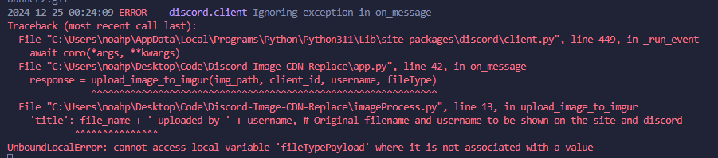

# Discord-Image-CDN-Replace IN DEVELOPMENT
- CDN Image Replaced with 3rd party image hosting automatically when user sets image in discord because discord image links only last 7 days

## TIMELINE
- 12/17/2024 DAY 1
    - Setup bot, and added feature for the bot to listen for any attachments and get the discord cdn which will be replaced. After getting the discord cdn it downloads the image to "imgs" directory. Did a little research with IMGUR API and my path for implementation using the API. Planning onto doing a little more research tomorrow and hopefully get some sort of implemenation started. Plan on setting up API account and using Postman to manage requests. Need to fix/add support for video files currently works only for images.

- 12/24/2024 DAY 2
    - Added connection between the imgur and discord. Added proper api call with client id to upload the users attachment (currently only have png, jpg, image files files working). Made changes to fix it only uploading the current images uploaded instead of all of the imgages in the imgs folder. Added auto delete feature and delete from imgs folder once file is synced to imgur. Need to add support to gifs and videos. Still determining the format the bot gives back into the chat.

## SOURCES
https://apidocs.imgur.com/#intro

## USER GUIDE
You can obtain your Client ID by registering an application on the Imgur website:
-Go to the Imgur API registration page.
-Log in with your Imgur account.
-Fill out the form to register your application. You can choose "OAuth 2 authorization without a callback URL" for simplicity.
-After registering, you will be provided with a Client ID and a Client Secret. Use the Client ID in your code.
-Replace 'IMGUR_CLIENT_ID' in the .env file with the actual Client ID provided by Imgur.

## REQUIRMENTS
- IMGUR API Client Key
- Postman (Optional)

